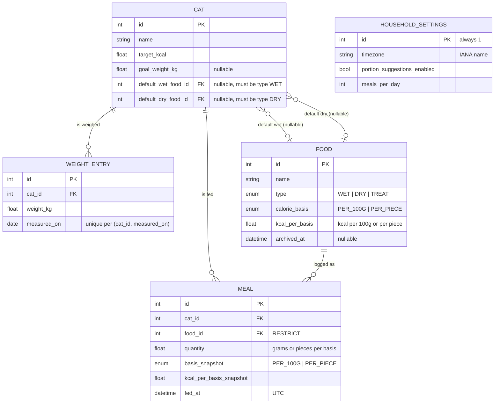

# Architecture

Current-state reference for how Cat Tracker works today. For *why* — the
scope decisions, the rejected alternatives, the phase-by-phase build order —
see the rebuild plan:
[`docs/plans/2026-07-10-feat-cat-tracker-rebuild-plan.md`](plans/2026-07-10-feat-cat-tracker-rebuild-plan.md).
That file is a historical record and is not updated as the app evolves; this
one is.

## System shape

One container, one process. `uvicorn` runs the FastAPI app, which serves the
JSON API under `/api` and the built React SPA (static files) at `/`, with a
client-routing fallback to `index.html` for any non-`/api` path. There is no
separate frontend server, reverse-proxying layer, or backend-for-frontend —
`app/main.py`'s `create_app()` mounts both in one place.

```
                 ┌────────────────────────┐
 Traefik  ─────▶ │  cattrack container     │
 (TLS, host      │  uvicorn :3000           │
  routing)       │  ┌───────────────────┐  │
                 │  │ FastAPI app        │  │
                 │  │  /api/*  → routers │  │
                 │  │  /*      → SPA     │  │
                 │  └─────────┬─────────┘  │
                 │            │ sync SQLAlchemy
                 │            ▼
                 │   SQLite (WAL) on
                 │   /data (cat_db volume)
                 └────────────────────────┘
```

Traefik terminates TLS and routes by hostname to the container; inside the
container FastAPI does all the routing. SQLite lives on the `cat_db` named
volume, in WAL mode with a busy timeout and foreign keys on (`app/db.py`).
SQLAlchemy is **sync**, and so are the route handlers (FastAPI runs them in
its threadpool) — a deliberate choice: at two users on SQLite, async buys
nothing and adds aiosqlite ceremony. Revisit only if the app ever grows real
concurrency (see the plan's Testing Strategy section).

## Two invariants

Everything else in the data model and services layer serves these two rules.
They exist to fix the two structural defects of the app this replaced
(ambiguous client-local timestamps, and meal calories that silently changed
when a food's kcal was edited later).

**True UTC + household-timezone bucketing.** Every stored `datetime` is a
true UTC instant — enforced by the `UTCDateTime` type decorator in
`backend/app/db.py`, which normalizes any bound value to UTC and re-attaches
`UTC` on read, so application code never has to guess what a naive value
meant. The household's one IANA timezone lives in the `household_settings`
singleton and is applied **only at the query/report boundary**:
`backend/app/services/timezones.py`'s `local_day_bounds` /
`local_range_bounds` convert a local calendar date to the UTC instant range
that day covers, DST included (`zoneinfo` handles 23h/25h transition days
correctly). The frontend never sends a timezone — `frontend/src/lib/format.ts`
converts between UTC instants and household wall-clock for display and for
edits (`zonedWallClock`, `wallClockToUtcISO`), entirely client-side, using
`Intl.DateTimeFormat` against the IANA name the API already gave it.

**Immutable meal history.** A `Meal` row snapshots `basis_snapshot` and
`kcal_per_basis_snapshot` from the food *at log time*
(`backend/app/models.py`). Meal kcal is always derived from those snapshot
fields, never from a live join to `food`. Editing a food's kcal value, or
changing a cat's default foods, never rewrites past meals. Snapshot fields
are recopied only when a `PATCH /meals/{id}` changes `food_id` or `quantity`;
editing just the date/time of a meal keeps the old snapshot. This is enforced
in the service layer (`backend/app/services/calories.py`) and covered
directly by tests — see the plan's "Model invariants" section for the full
enumeration (food deletion → archive-not-delete, food `type` immutable after
creation, etc.).

## Data model



Notable constraints (all in `backend/app/models.py`): a cat has no `weight`
column — "current weight" is the latest `WEIGHT_ENTRY` row, unique per
`(cat_id, measured_on)` so a same-day re-weigh upserts. `meal.food_id` is
`ON DELETE RESTRICT`, which is why the foods router archives (sets
`archived_at`) instead of hard-deleting a food once any meal references it.
Deleting a cat cascades to its meals and weight entries. `household_settings`
is a singleton pinned to `id = 1` via a check constraint, auto-created on
first access with `timezone` seeded from `APP_TIMEZONE`.

## API surface

All endpoints live under `/api`, JSON in and out, no auth (LAN/Traefik-fronted
household app, by design — see `FEATURE_PARITY.md`'s Out of Scope). The live,
authoritative contract is the generated OpenAPI schema, browsable at
`/docs` (or `/openapi.json`) on any running instance. In short:

- `cats` (+ `cats/{id}/weights` for weigh-ins)
- `foods`
- `meals` (+ `meals/suggestions` for fast re-log chips)
- `settings` (singleton)
- `reports/today`, `reports/range`, `reports/comparison`
- `target-suggestion` (RER/MER calculator)
- `health` (Docker healthcheck)

## Backend layout

```
backend/app/
├── main.py        # app factory: mounts routers under /api, then the SPA at /
├── config.py      # pydantic-settings: DATABASE_URL, APP_TIMEZONE, FRONTEND_DIST
├── db.py          # engine (WAL/busy-timeout/FK pragmas), UTCDateTime, session dependency
├── models.py      # all SQLAlchemy models — small app, one module
├── schemas.py     # Pydantic request/response models
├── routers/       # cats, foods, meals, settings, reports, target, health — thin
└── services/       # calories, reports, suggestions, target, timezones — all the math
```

Routers stay thin: request/response wiring and calling into `services/`.
Every calorie, report, and calculator formula lives in `services/` as
unit-tested pure functions — `calories.py` (kcal derivation, snapshot copy,
grams conversions, portion math), `reports.py` (today/range/comparison
aggregation), `suggestions.py` (re-log chip ranking), `target.py`
(RER/MER calculator), `timezones.py` (local-day bucketing, see above). The
frontend never computes calories; it only renders what these return.

## Frontend data-layer conventions

- **Generated types are the contract.** `pnpm gen:api` (`frontend/scripts/gen-api.sh`)
  imports the FastAPI app in-process, dumps its OpenAPI schema, and feeds it
  to `openapi-typescript`, producing `frontend/src/api/types.gen.ts`. App code
  never imports that file directly — `frontend/src/api/types.ts` re-exports
  `components["schemas"]` under friendlier aliases, and everything else
  imports from there. Regenerate and commit `types.gen.ts` after any backend
  request/response model change; a clean tree should produce zero diff.
- **Query keys are hierarchical**, defined once in `frontend/src/api/query-keys.ts`.
  A coarse key like `['cats']` covers every cat-scoped query (list, detail,
  weights) so `invalidateQueries({ queryKey: queryKeys.cats.all })` refreshes
  all of them. Each mutation calls one of the file's `invalidateAfter*`
  helpers — these are the single source of truth for which caches a mutation
  touches; call sites never hand-roll invalidation. The helpers are
  deliberately generous (e.g. a food mutation also invalidates `meals` and
  `reports`, since recent-meal rows show live food names and re-log chips
  price against current food data) — see the file's doc comments for the
  per-mutation reasoning.
- **`staleTime: 0` + `refetchOnWindowFocus: true`** (`frontend/src/api/query-client.ts`).
  This is a two-phone household: a mutation's cache invalidation only repairs
  the device that made it, so the other phone's copy is stale until it
  refetches. `refetchOnWindowFocus` (TanStack listens for `visibilitychange`,
  which fires on iOS PWA resume) means reopening the app picks up whatever
  the partner's device just saved. `staleTime: 0` matches that intent: on a
  LAN talking to SQLite, an extra request per refetch is free, so there's no
  reason to let "not stale yet" skip a focus-triggered refetch and show
  minutes-old data.
- **Dirty-form guard in dialogs seeded from live queries.** Dialogs like
  `frontend/src/components/settings/cat-form-dialog.tsx` hold their own local
  form state (`useState`), seeded from the query-backed prop in a `useEffect`
  keyed on `[open, entity]` rather than on every render. Combined with
  `staleTime: 0`, the underlying query can refetch and change while a dialog
  is open (a background window-focus refetch, the other phone's edit landing);
  keying the reset on identity rather than on the data itself means an
  in-progress edit is not silently clobbered by that refetch. The effect only
  re-seeds when the dialog (re)opens or targets a different entity.
- **Household-timezone date idiom** lives in `frontend/src/lib/format.ts`:
  `zonedWallClock` / `wallClockToUtcISO` convert between a UTC instant and
  household wall-clock via `Intl.DateTimeFormat`, and `todayInHouseholdTz`
  is the one correct way to get "today" for a default or range boundary —
  never fall back to the browser's own local date, since the viewer and
  household timezones can differ.

## Theming

Light / dark / system, chosen from a three-way toggle in Settings
(`frontend/src/components/settings/theme-toggle.tsx`). The mechanism is
class-strategy with a system fallback, all in `frontend/src/lib/theme.ts` and
`frontend/src/index.css` — no `next-themes` or other theme library:

- `lib/theme.ts` persists the mode (`light`/`dark`/`system`) in `localStorage`
  and reflects it onto `<html>` as a `data-theme` attribute — set to
  `light`/`dark` for an explicit choice, **removed** for `system`. `mode` and
  the current OS preference live in one module-level store (subscribed to via
  `useSyncExternalStore`), not per-hook `useState`, so every `useThemeMode`
  consumer (the Settings toggle, the `Toaster`, ...) re-renders together on a
  change instead of drifting out of sync until a remount. The store tracks
  `matchMedia` unconditionally (not just while in system mode), so switching
  back to system mode is never stale — the CSS itself still does the actual
  repaint via the media query.
- `index.css` defines the design tokens so dark applies **both** under
  `[data-theme="dark"]` (explicit) and under
  `@media (prefers-color-scheme: dark)` scoped to `:root:not([data-theme])`
  (system default); light lives on `:root, [data-theme="light"]`. The Tailwind
  `dark:` variant is redefined to match the same two conditions. Absent/invalid
  storage ⇒ system, identical to the app's original behavior.
- A tiny inline script in `index.html` applies the stored mode in `<head>`
  before first paint, so there's no flash of the wrong theme.
- Charts follow automatically: their `ChartConfig`s reference `color:
  var(--chart-N)`, and those CSS variables flip with the tokens above — the
  chart `theme` key is deliberately not used. The PWA `theme-color` metas still
  key off `prefers-color-scheme` (OS only), an accepted limitation for the
  status-bar color.

## Strictness profiles

- **Backend:** `ruff` lints with 38 rule groups selected (`backend/pyproject.toml`
  — pyflakes, bugbear, bandit, datetimez, pylint, tryceratops, and more), plus
  `ruff format`. `mypy --strict` covers `app` **and** `tests` (with a narrower
  override relaxing untyped-def/call rules inside `tests/`, since fixtures and
  demo values don't need the same annotation discipline as application code).
- **Frontend:** `tsconfig.app.json` adds `noUncheckedIndexedAccess`,
  `noUnusedLocals`/`noUnusedParameters`, `noImplicitOverride`, and
  `noFallthroughCasesInSwitch` on top of the strict defaults. `oxlint`
  (`frontend/.oxlintrc.json`) runs as the fast lint pass in CI, with
  `correctness`/`suspicious` at error and `pedantic` at warn.

## CI and image publishing

`.github/workflows/ci.yml` runs three jobs on every PR and on push to `main`:
`backend` (`uv sync --frozen` → `ruff check` → `ruff format --check` →
`mypy` → `pytest`), `frontend` (`pnpm install --frozen-lockfile` →
`tsc -b` → `oxlint` → `vitest run` → `vite build`), and `docker` (builds the
multi-stage image on every PR; on push to `main`, also logs in and pushes to
GHCR as `ghcr.io/<repo, lowercased>:latest`).

## Deploy and rollback

`Dockerfile` is a two-stage build: `node:22-alpine` + pnpm builds
`frontend/dist`, then `python:3.14-slim` `uv sync --frozen --no-dev`s the
backend and copies the built SPA in. `docker-entrypoint.sh` runs
`alembic upgrade head` and then `exec`s `uvicorn app.main:app --host 0.0.0.0
--port 3000` as PID 1.

`docker-compose.yml` on the Traefik host preserves the deploy contract:
container name `cattrack`, `2137:3000` port map, the `cat_db` named volume
mounted at `/data`, and the `/api/health` healthcheck. Cutover is
`docker compose pull && docker compose up -d` (or `up -d --build` when
building locally); rollback is reverting the compose image tag and
redeploying — the database is untouched by either direction since it lives on
the named volume, not in the image.
