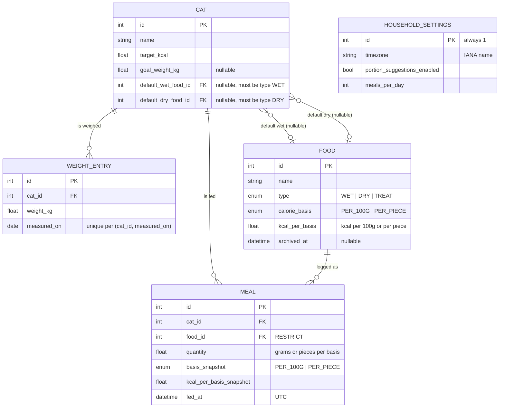

# ✨ Cat Tracker Ground-Up Rebuild

## Overview

Rebuild Cat Tracker from scratch in this repo: a FastAPI + SQLite backend that owns all calorie/report math, and a Vite + React (shadcn/ui) SPA served from the same container. The old Next.js/Prisma app is deleted; **FEATURE_PARITY.md is the spec of record** — all scope decisions there are locked and are not re-litigated here. This plan turns the spec into an execution order, concrete contracts, and acceptance criteria.

The two structural defects the rebuild exists to fix, and which every design choice below serves:

1. **Ambiguous time.** Old app stored client wall-time with a fake `Z` suffix. New app: true UTC in the DB, one household timezone in settings drives all day bucketing.
2. **Mutable history.** Old app computed meal calories from the cat's *current* food at display time. New app: meals snapshot calorie data at log time; history is immutable.

## References

- Spec of record: [FEATURE_PARITY.md](../../FEATURE_PARITY.md) (rewritten 2026-07-10 after scope session)
- Versions verified 2026-07-10 via npm: React 19.2, Vite 8.1, Tailwind 4.3, Recharts 3.9, shadcn CLI 4.13, TanStack Query 5.101 — re-verify and pin at scaffold time; let the shadcn charts release dictate the Recharts major.
- Deploy contract to preserve: `docker-compose.yml` (Traefik labels, port 2137→3000 mapping, named volume, `/api/health` healthcheck)
- TaskList driving implementation: `session-800a2b04` (7 phase tasks with dependencies)

## Locked Constraints (from spec — recap only)

| Area | Decision |
|---|---|
| Backend | Python 3.14, FastAPI, SQLite, SQLAlchemy 2 + Alembic, `uv` |
| Frontend | Vite + React 19 SPA, shadcn/ui + shadcn charts, Tailwind 4, pnpm |
| Deploy | Single container; FastAPI serves API + built SPA; existing Traefik contract |
| Data | Fresh empty DB; no migration; 3 cats, design for ~3 not N |
| Time | UTC storage; household timezone setting; frontend never sends a timezone |
| Units | Metric only (kg, g, kcal); treats may be per-piece |
| Mobile | Dashboard mobile-first (iPhone 13 mini, 375 pt); History/Settings desktop-first; installable PWA, online-only |
| Theme | System `prefers-color-scheme` only, no toggle |
| Out | Auth, users, households, lbs, offline, notifications, photos, per-cat meals-per-day |

## Repository Layout

```
cat_tracker/
├── backend/
│   ├── app/
│   │   ├── main.py              # app factory, routers, StaticFiles + SPA fallback
│   │   ├── config.py            # pydantic-settings: DATABASE_URL, APP_TIMEZONE default
│   │   ├── db.py                # engine (WAL), session dependency
│   │   ├── models.py            # all SQLAlchemy models (small app → one module)
│   │   ├── schemas.py           # Pydantic request/response models
│   │   ├── routers/             # cats.py foods.py meals.py settings.py reports.py health.py
│   │   └── services/
│   │       ├── calories.py      # kcal math, snapshot logic, grams conversions, portions
│   │       ├── reports.py       # today/range/comparison aggregation, day bucketing
│   │       ├── suggestions.py   # re-log chip combos
│   │       └── target.py        # RER/MER calculator
│   ├── alembic/  alembic.ini
│   ├── tests/
│   ├── pyproject.toml  uv.lock
│   └── seed.py                  # dev seed (3 cats, a few foods, sample meals)
├── frontend/
│   ├── src/
│   │   ├── main.tsx  App.tsx  routes.tsx
│   │   ├── api/                 # generated types (openapi-typescript) + fetch wrapper + query hooks
│   │   ├── pages/               # dashboard/  history/  settings/
│   │   ├── components/          # shared: app-shell, cat-chip-row, quantity-input, …
│   │   └── lib/
│   ├── index.html  vite.config.ts  package.json  pnpm-lock.yaml
│   └── public/                  # manifest.webmanifest, icons, apple-touch-icon
├── Dockerfile                   # multi-stage: node build → python runtime
├── docker-compose.yml           # same Traefik/volume/healthcheck contract
├── .github/workflows/ci.yml     # replaces node.js/codeql/codacy/docker-image workflows
├── FEATURE_PARITY.md
└── docs/plans/
```

**Deleted in Phase 0:** `src/`, `prisma/`, `backup/`, `scripts/`, `public/` (old), all Next/Jest/Tailwind3 configs, `package.json` + both lockfiles at root, `.github/workflows/*` (old four), `.github/todo.md`. Kept: `FEATURE_PARITY.md`, `docs/`, `.git`, `.gitignore` (rewritten).

## Data Model



### Model invariants (enforce in service layer + tests)

- **Snapshot rule:** `POST /meals` and any `PATCH` that changes `food_id` or `quantity` re-copies `basis` and `kcal_per_basis` from the food *at that moment*. Editing a food's kcal never changes existing meals. Meal kcal is always derived from snapshot fields, never from the joined food.
- **Kcal derivation:** `PER_100G → quantity / 100 * kcal_per_basis`; `PER_PIECE → quantity * kcal_per_basis`.
- **Cat has no weight column.** Current weight = latest `WEIGHT_ENTRY`. Creating a cat with an initial weight creates the first entry in the same transaction.
- **Defaults are nullable** (fresh DB has no foods yet — avoids the old app's chicken-and-egg FK). Validation: default wet must be a `WET` food, default dry a `DRY` food, neither archived. Features degrade gracefully when a default is missing (see Edge Cases).
- **Food deletion:** hard delete only if no meal references it; otherwise set `archived_at`. Archived foods are excluded from all dropdowns/defaults but still join into history.
- **Food `type` is immutable** after creation (a WET food becoming a TREAT would corrupt default-food semantics). `calorie_basis` and `kcal_per_basis` are editable — snapshots protect history.
- **Settings singleton:** row auto-created on first access with `timezone` from `APP_TIMEZONE` env (fallback `UTC`), `portion_suggestions_enabled=false`, `meals_per_day=2`. `GET`/`PUT` only.
- **Cat deletion:** cascade to meals + weight entries. `GET /cats/{id}` includes `meal_count` so the UI confirm dialog can say what's being destroyed.
- **Timestamps:** stored UTC. All report/query date params are **local dates** (`YYYY-MM-DD`) interpreted in the household timezone; the backend converts to UTC instants via `zoneinfo`.

## Calorie & Report Math (backend-owned, `services/`)

All formulas live in `backend/app/services/` with exhaustive unit tests. The frontend renders numbers; it never computes them.

- **Today (per cat):** consumed = Σ meal kcal where `fed_at` in [local midnight, next local midnight); remaining = target − consumed (may be negative); over = remaining < 0; grams-equivalent = `max(remaining, 0) / (kcal_per_100g / 100)` for each non-archived `PER_100G` default food.
- **Portion suggestion (per cat):** `target_kcal / meals_per_day` → grams of default wet and dry (only when the toggle is on and the default exists).
- **Range report (per cat):** daily kcal series bucketed by local date with target line; `avg_kcal_per_day` over the range; **trend** = % delta of avg vs the immediately preceding window of equal length (null if that window has no meals); **timing pattern** = 7×24 matrix of meal counts by local weekday × hour; **portion history** = per-meal (fed_at, grams, WET|DRY) for `PER_100G` meals (treats excluded — pieces don't belong on a grams chart); **weight series** = weight entries in range + `goal_weight_kg` for the goal line.
- **Comparison (all cats, shared range):** per cat `avg_kcal_per_day`, target, adherence = `avg / target × 100`.
- **Target suggestion:** `RER = 70 × kg^0.75`. With goal weight: `0.8 × RER(goal_weight_kg)` (weight-loss factor on ideal weight). Without: `1.2 × RER(current_weight_kg)` (neutered-adult maintenance). Response includes the formula breakdown and current/goal inputs so the UI can show its work. Always a suggestion — never auto-applied.
- **Re-log suggestions (per cat):** group last 14 days of meals by `(food_id, quantity)`, rank by count then recency, top 3, plus the most recent meal if not already present. If no history: fall back to `(default food, portion-suggestion grams)` when available.

```python
# backend/app/services/reports.py — day bucketing is THE correctness hotspot
def local_day_bounds(day: date, tz: ZoneInfo) -> tuple[datetime, datetime]:
    # zoneinfo handles DST: 23h/25h days produce correct UTC bounds
    start = datetime.combine(day, time.min, tzinfo=tz)
    return start.astimezone(UTC), (start + timedelta(days=1)).astimezone(UTC)
```

## API Contract

All under `/api`, JSON, FastAPI-generated OpenAPI is the source for frontend types. No auth (LAN/Traefik-fronted household app, per spec).

| Endpoint | Methods | Notes |
|---|---|---|
| `/api/health` | GET | `{status: "ok"}` — docker healthcheck contract |
| `/api/cats` | GET, POST | POST accepts `initial_weight_kg` → creates first weight entry |
| `/api/cats/{id}` | GET, PATCH, DELETE | GET includes `current_weight_kg`, `meal_count`; DELETE cascades |
| `/api/cats/{id}/weights` | GET, POST | POST `{weight_kg, measured_on}` **upserts** on (cat, date) |
| `/api/cats/{id}/weights/{date}` | DELETE | |
| `/api/foods` | GET, POST | GET `?include_archived=true` for settings table |
| `/api/foods/{id}` | PATCH, DELETE | DELETE archives if referenced by meals, else hard-deletes |
| `/api/meals` | GET, POST | GET `?cat_id&start&end&limit` (local dates; `limit` alone → recent list). POST optional `fed_at` (default now) |
| `/api/meals/{id}` | PATCH, DELETE | PATCH re-snapshots if food/quantity changed |
| `/api/meals/suggestions` | GET | `?cat_id` → re-log chips |
| `/api/settings` | GET, PUT | singleton |
| `/api/reports/today` | GET | all cats in one payload |
| `/api/reports/range` | GET | `?start&end&cat_id` → everything History needs for one cat in one round trip |
| `/api/reports/comparison` | GET | `?start&end` |
| `/api/target-suggestion` | GET | `?cat_id` |

Meal responses always include derived `kcal`, the food name (via join), and snapshot fields. Static serving: `frontend/dist` mounted at `/`, catch-all returns `index.html` for non-`/api` paths (client routing), `/api/*` unknown routes 404 as JSON.

## Frontend Architecture

- **Routes:** `/` (Dashboard), `/history`, `/settings` — react-router (library mode), lazy-loaded History (charts are the heavy chunk).
- **Data layer:** `openapi-typescript` generates types from `/openapi.json` (`pnpm gen:api`, committed); thin `fetch` wrapper; TanStack Query for caching/invalidation (log meal → invalidate `today` + `meals`). No global store.
- **Shell:** bottom tab bar on <768px (3 tabs, thumb-reachable), top nav on desktop.
- **Dashboard (mobile-first, 375 pt):** cat chip row (3 cats, one row) → tapping a cat reveals re-log chips + compact manual form (food select defaulted, quantity, treat dropdown); compact per-cat today status (all 3 visible without scrolling past entry); recent meals list with edit/delete via bottom sheet (edit includes cat/food/quantity/date/time); weekly mini-summary at the bottom.
- **History (desktop-first):** range picker with presets (7/30/90 days, custom), cat tabs, charts from one `reports/range` call: daily kcal + target line, weekday×hour timing heatmap, portion history, weight trend + goal line (with weigh-in entry dialog), comparison section (`reports/comparison`).
- **Settings (desktop-first):** foods table (add/edit/archive; type + basis at creation; kcal editable), cats table (name, target kcal with calculator dialog showing RER breakdown, goal weight optional, default wet/dry selects, weigh-in button, delete with meal-count confirm), household card (timezone select, portion toggle, meals/day).
- **Theming:** Tailwind dark mode via `prefers-color-scheme` (media strategy — no `dark` class toggling, no toggle UI).
- **Charts:** shadcn chart components over Recharts. **Read the `dataviz` skill before writing any chart code** (palette, dark-mode-safe colors, heatmap guidance).
- **PWA:** `manifest.webmanifest`, icons, `apple-touch-icon`, iOS meta tags. **No service worker** — online-only per spec; iOS Add-to-Home-Screen needs only manifest + icons.

## Docker & Deploy

Multi-stage `Dockerfile`:

1. `node:22-alpine` + pnpm → `frontend/dist`
2. `python:3.14-slim` + `uv sync --frozen`; copy `dist` in; entrypoint runs `alembic upgrade head` then `uvicorn app.main:app --host 0.0.0.0 --port 3000` (port 3000 preserves the compose mapping). Single worker; SQLite in WAL mode — ample for 2 users.

`docker-compose.yml` keeps: container name, `2137:3000`, Traefik labels, `cat_db:/data` volume, healthcheck against `/api/health`. Env: `DATABASE_URL=sqlite:////data/cat_tracker.db` (fresh file — old `dev.db` left untouched in the volume as cold archive), `APP_TIMEZONE` for first-run settings default. Cutover = build + `docker compose up -d`; rollback = revert compose to the old image.

## CI (`.github/workflows/ci.yml`)

- **backend:** `uv sync` → `ruff check` + `ruff format --check` → `mypy` (strict) → `pytest`
- **frontend:** `pnpm install --frozen-lockfile` → `tsc --noEmit` → `vitest run` → `vite build`
- **docker:** build the image on PRs; build + push to GHCR on `main`
- Old workflows (node.js, CodeQL, Codacy, docker-image) deleted in Phase 0.

## Implementation Phases

TaskList `session-800a2b04` mirrors these phases with dependencies (0→1→{2,3}→{4,5}→6). Each phase is one PR-sized unit ending with CI green.

### Phase 0 — Demolition & skeleton (task #1)

- [ ] Branch `rebuild`; delete legacy app (list above); rewrite `.gitignore`, minimal `README.md` placeholder
- [ ] `backend/`: uv project; FastAPI app factory; `config.py`; `/api/health`; Alembic init (empty baseline); ruff/mypy/pytest configured in `pyproject.toml`; one smoke test
- [ ] `frontend/`: Vite + React + TS; Tailwind 4; shadcn init; router with 3 stub pages; shell with bottom-tab/top-nav; dark mode via media query verified
- [ ] `Dockerfile` (multi-stage) + updated `docker-compose.yml`; SPA fallback serving works in-container
- [ ] `ci.yml` replacing all old workflows

**Accept:** `docker compose up` serves the SPA shell at `/`, `/api/health` returns 200 through the container healthcheck, CI green on the branch.

### Phase 1 — Core domain (task #2)

- [ ] `models.py` + initial Alembic migration (all 5 tables, constraints: weight unique per cat/date, enums, FK behaviors)
- [ ] `services/calories.py` (kcal derivation, snapshot copy, grams conversions, portion math) — pure functions, fully unit-tested
- [ ] Routers + schemas: cats (incl. weights upsert/delete, meal_count, cascade delete), foods (archive-on-delete, type immutability), meals (snapshot on create/edit, local-date filtering, limit), settings (singleton auto-create, IANA tz validation via `zoneinfo`)
- [ ] `seed.py`: 3 cats, 2 wet + 2 dry + 2 treat foods (one per-piece), two weeks of plausible meals + weigh-ins
- [ ] Tests: snapshot immutability (edit food kcal → old meal kcal unchanged), tz bucketing incl. DST boundary days, defaults validation, archive behavior

**Accept:** full CRUD via `httpx` TestClient; `pytest` covers every invariant listed under Model Invariants.

### Phase 2 — Reports & calculators (task #3)

- [ ] `services/reports.py`: today, range (series/avg/trend/timing-matrix/portion-history/weight-series), comparison
- [ ] `services/target.py`: RER/MER with breakdown payload
- [ ] `services/suggestions.py`: re-log combos with fallback
- [ ] Routers: `reports/*`, `target-suggestion`, `meals/suggestions`
- [ ] Tests: golden-number tests for every formula (hand-computed expectations); empty-range, no-previous-period, missing-defaults, treat-heavy-day, DST-day cases

**Accept:** each endpoint returns exactly the shapes the frontend sections consume; math verified against hand-computed fixtures.

### Phase 3 — Frontend foundation + Settings (task #4)

- [ ] `pnpm gen:api` pipeline; fetch wrapper; TanStack Query setup with invalidation map
- [ ] Settings page complete: foods table, cats table (calculator dialog, weigh-in dialog, goal weight, defaults, delete-with-count confirm), household card
- [ ] Component tests for the calculator dialog and food-archive flows

**Accept:** starting from an empty DB in the browser, you can create foods → cats (with calculator-suggested targets) → adjust settings, entirely through the UI.

### Phase 4 — Dashboard (task #5)

- [ ] Quick-log flow: cat chips → suggestion chips (`meals/suggestions`) → confirm; manual path with defaulted food + numeric-keyboard quantity input; treat dropdown
- [ ] Today status per cat (target/consumed/remaining/over + grams-equivalent), all 3 cats above the fold at 375×812
- [ ] Recent meals with edit/delete bottom sheet (edit covers cat, food, quantity, date, time)
- [ ] Weekly mini-summary; component tests for the quick-log flow
- [ ] 375 pt pass: routine meal logged in ≤2 taps + confirm, one-handed, no horizontal scroll

**Accept:** in iPhone 13 mini viewport (browser devtools), a routine wet-food meal is logged in two taps; today numbers update without reload; over-target cat is visually distinct.

### Phase 5 — History (task #6)

- [ ] Read `dataviz` skill; build chart components: daily kcal + target, timing heatmap, portion history, weight trend + goal line, comparison
- [ ] Range picker with presets; cat tabs; weigh-in entry from the weight section
- [ ] Loading/empty states per chart; light + dark verified

**Accept:** with seeded data, every FEATURE_PARITY History feature renders; one `reports/range` request per cat view; charts legible in both themes on desktop.

### Phase 6 — PWA, polish, cutover (task #7)

- [ ] Manifest, icons, iOS meta; installs to home screen on iOS
- [ ] Empty states (no foods / no cats / no meals) with pointers to Settings
- [ ] README rewrite (dev setup: `uv run`, `pnpm dev` with Vite proxy to `:3000`; deploy notes)
- [ ] GHCR push on main; run `/verify` end-to-end in the container (create food → cat → log meal → today report → history range → edit meal → delete)
- [ ] Deploy to the Traefik host; confirm healthcheck + PWA install from both phones; merge `rebuild` → `main`

**Accept:** production container serving at the existing hostnames; both users have it installed; old workflows/code fully gone from `main`.

## Edge Cases & Behavioral Decisions (inline SpecFlow)

| Situation | Decided behavior |
|---|---|
| Empty food library / cat without default wet or dry | Cat creation allowed; grams-equivalent + portion suggestion omitted for the missing type; dashboard empty state links to Settings |
| Default food archived | Archiving a food clears it from cat defaults (with UI warning listing affected cats) |
| Meal references archived food | Renders normally in history (join still works); food absent from logging dropdowns |
| Edit meal after food kcal corrected | Changing food/quantity re-snapshots at current values; editing only date/time keeps the old snapshot |
| Over target | `remaining` goes negative in API; grams-equivalent clamps to 0; UI shows over-by amount |
| Two weigh-ins same day | Upsert — second replaces first |
| No previous-period data | `trend: null`; UI shows "—" |
| DST transition days | 23h/25h local days bucket correctly via `zoneinfo`; explicit test fixtures |
| Household timezone changed | Historical bucketing shifts accordingly — documented, accepted (spec: single-household app) |
| Meal logged near midnight | Belongs to the local day of `fed_at` in household tz; editing time across midnight moves it between days |
| Cat deleted | Cascade removes meals + weights; UI confirm shows counts; no undo (household app, deliberate) |
| Concurrent edits (2 users) | Last write wins; no locking — accepted at this scale |
| Suggestions with no history | Fall back to default food + portion grams; hide chips entirely if neither exists |
| Treats in portion-history chart | Excluded (pieces ≠ grams); still count in all kcal totals |

## Testing Strategy

- **Backend is the priority** — it owns all math. Pure-function unit tests for `services/*` with hand-computed golden numbers; TestClient integration tests for routers; every Model Invariant and Edge Case row above has a corresponding test.
- **Frontend:** vitest + Testing Library for the flows where regressions hurt (quick-log, meal edit, calculator dialog). No E2E framework — the Phase 6 `/verify` pass covers end-to-end manually in the container.
- **Deliberate choice: sync SQLAlchemy + sync endpoints** (FastAPI threadpool). At 2 users on SQLite, async adds ceremony and aiosqlite quirks for zero benefit. Revisit only if the app ever grows real concurrency.

## Dependencies & Risks

- **shadcn charts ↔ Recharts major:** install whatever the current shadcn charts release targets; don't hand-upgrade Recharts past it. (Verified compatible majors exist as of 2026-07.)
- **Python 3.14 wheels:** if any dependency lacks 3.14 wheels at scaffold time, drop to 3.13 — no code impact.
- **SQLite in Docker volume:** enable WAL + `busy_timeout`; single uvicorn worker keeps writes serialized.
- **iOS PWA quirks:** installability needs correct manifest + apple-touch-icon; test on a real device in Phase 6, not just devtools.

## Out-of-Scope Guardrails (do not build)

No auth/users/sessions, no per-cat meals-per-day, no unit conversion layer, no service worker/offline, no i18n, no pagination or search over cats/foods, no soft-delete for cats/meals, no admin endpoints. If an implementation step seems to need one of these, stop and re-read FEATURE_PARITY.md.
